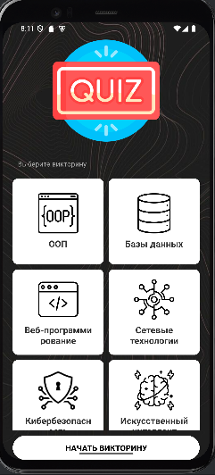
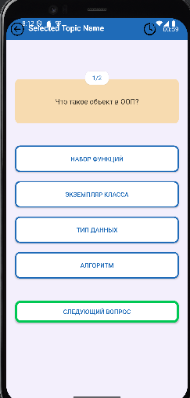
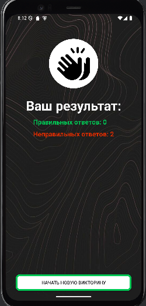

# Quiz App (Android)

Простое Android-приложение для прохождения викторин по теме "Объектно-ориентированное программирование (ООП)".

## Функционал

- Главный экран с кнопкой запуска викторины.
- Викторина состоит из вопросов по теме "ООП".
- Пользователь выбирает один из четырёх вариантов ответа.
- После прохождения всех вопросов отображается результат: сколько ответов дано верно из общего количества.
- Возможность вернуться на главный экран и пройти тест заново.

## Технологии

- Язык: **Java**
- Платформа: **Android**
- Архитектура: Activity + Layout (без ViewModel или фреймворков)
- Данные: жёстко заданные вопросы в классе `QuestionsBank`

## Структура проекта

- `MainActivity.java` — стартовый экран.
- `QuizActivity.java` — логика викторины.
- `QuizResultsActivity.java` — экран с результатами.
- `QuestionsList.java` — модель вопроса.
- `QuestionsBank.java` — хранилище вопросов по темам.
- `activity_main.xml`, `activity_quiz.xml`, `activity_results.xml` — макеты экранов.

## Скриншоты проекта

## Скриншоты

### Главный экран

### Экран викторины

### Результаты

## Как запустить

1. Откройте проект в **Android Studio**.
2. Подключите устройство или запустите эмулятор.
3. Нажмите **Run** (▶️).
